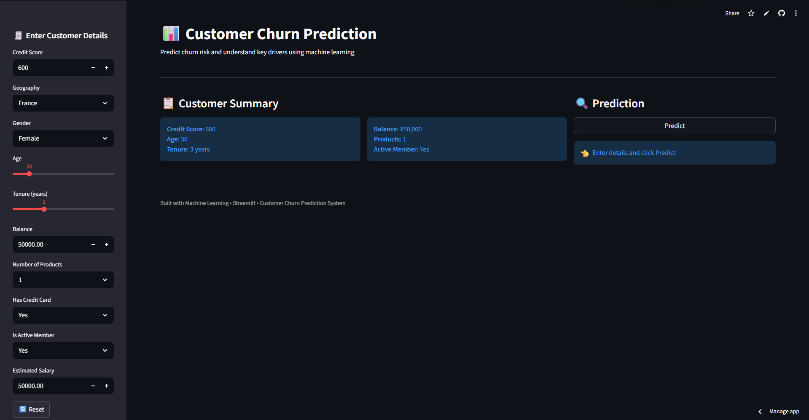
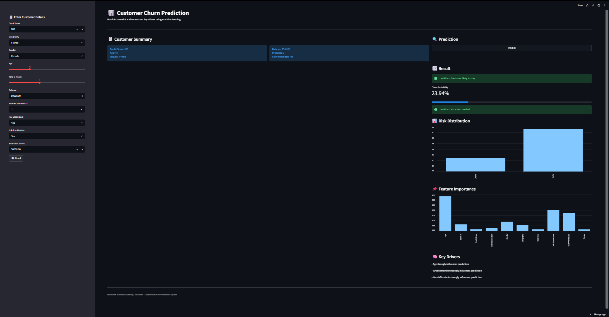
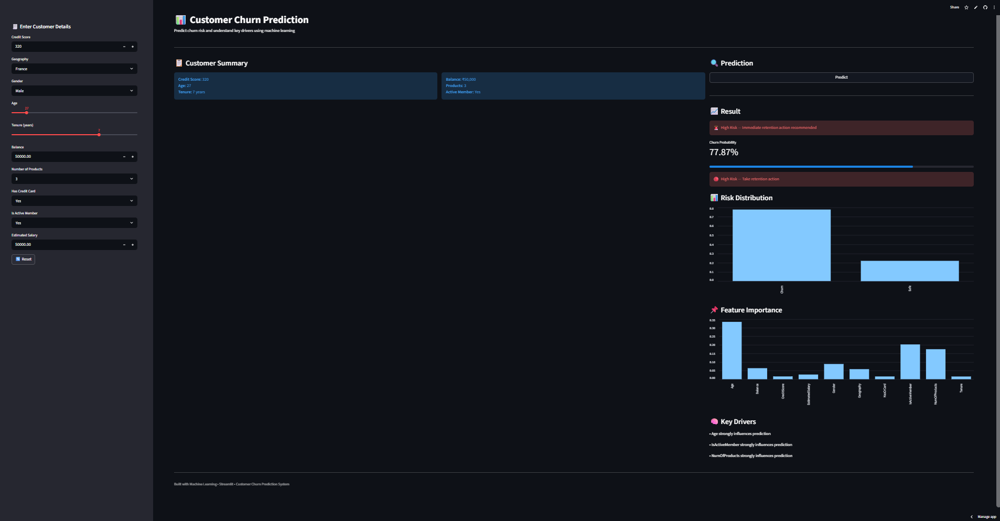
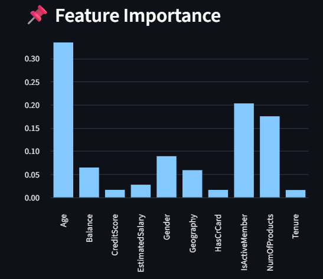

# 📊 Customer Churn Prediction System

An end-to-end Machine Learning project that predicts whether a customer is likely to churn using classification models and an interactive Streamlit web application.

---

## 🚀 Live Demo

👉 [*(Click here to try the app)*](https://codsoftcustomerchurnprediction-zowd2wdbwnjnbtvbkzsmbl.streamlit.app/)

---

## 📸 Screenshots

### 🔹 Input Interface



### 🔹 Prediction Result (Low Risk)



### 🔹 Prediction Result (High Risk)



### 🔹 Feature Importance



---

## 🧠 Project Overview

This project predicts customer churn using historical banking data. It covers the complete Machine Learning pipeline:

* Data cleaning and preprocessing
* Feature encoding and scaling
* Handling class imbalance using **SMOTE**
* Training and comparing multiple models
* Selecting the best model based on **ROC-AUC**
* Building an interactive **Streamlit application**
* Adding model explainability (feature importance + key drivers)

---

## ⚙️ Tech Stack

* **Python**
* **Pandas, NumPy**
* **Scikit-learn**
* **Imbalanced-learn (SMOTE)**
* **Matplotlib**
* **Streamlit**
* **Joblib**

---

## 📊 Model Performance

| Model                     | Accuracy | ROC-AUC |
| ------------------------- | -------- | ------- |
| Logistic Regression       | ~0.73    | ~0.74   |
| Random Forest             | ~0.81    | ~0.84   |
| Gradient Boosting (Final) | ~0.80    | ~0.85   |

👉 **Gradient Boosting Classifier** was selected as the final model due to the highest ROC-AUC score.

---

## 🎯 Key Features

* 🔍 Real-time churn prediction
* 📈 Probability visualization
* ⚠️ Risk classification (Low / Medium / High)
* 📊 Feature importance analysis
* 🧠 Key driver insights
* 🖥️ Clean and responsive UI

---

## 📁 Project Structure

```
customer-churn-prediction/
│
├── app/
│   └── app.py              # Streamlit UI
│
├── data/
│   └── Churn_Modelling.csv
│
├── models/
│   ├── model.pkl
│   ├── scaler.pkl
│   ├── le_gender.pkl
│   └── le_geo.pkl
│
├── src/
│   ├── train.py
│   ├── predict.py
│   └── preprocessing.py
│
├── screenshots/            # UI images
│
├── requirements.txt
├── README.md
├── LICENSE
└── .gitignore
```

---

## ▶️ How to Run Locally

```bash
# Clone the repository
git clone https://github.com/your-username/customer-churn-prediction.git

# Navigate to project folder
cd customer-churn-prediction

# Create virtual environment
python -m venv venv

# Activate environment
venv\Scripts\activate

# Install dependencies
pip install -r requirements.txt

# Run Streamlit app
cd app
streamlit run app.py
```

---

## 🧪 Model Workflow

1. Load dataset
2. Clean and preprocess data
3. Encode categorical variables
4. Apply SMOTE for class balancing
5. Scale features
6. Train multiple models
7. Evaluate using ROC-AUC
8. Select best model (Gradient Boosting)
9. Save model and preprocessors
10. Deploy via Streamlit

---

## 🔮 Future Improvements

* SHAP-based explainability
* Model deployment (Streamlit Cloud)
* Dashboard analytics
* User authentication

---

## 👤 Author

**Susovan Hati**

---

## 📄 License

This project is licensed under the MIT License.